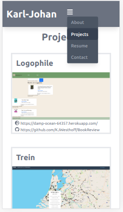
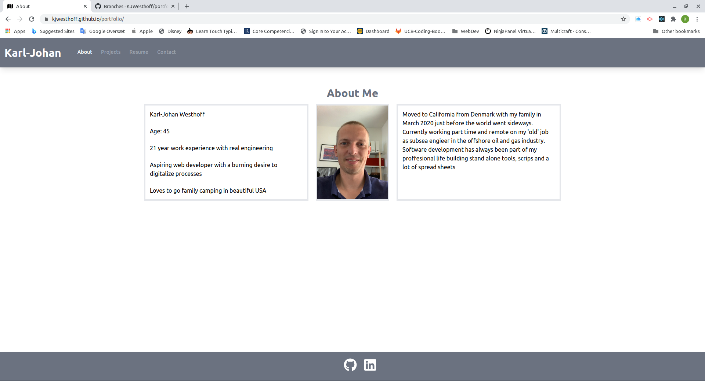
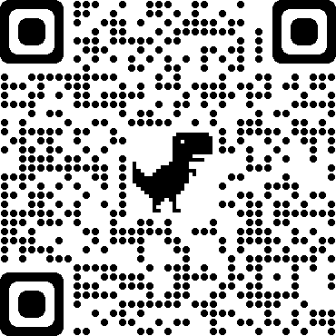

  # Project Title: React Portfolio 
  ### 
  
  ## Table of contents:
  1. [Title](#Project-Title)
  1. [License](#License)
  1. [Project Description](#Project-Description)
  1. [Installation](#Installation-Instructions)
  1. [Useage](#How-To-Use)
  1. [How to Contribute](#How-to-Contribute)
  1. [Test Instructions](#Test-Instructions)
  1. [Questions](#Questions)

  ## License: 
  ### This project is licensed under MIT (click on icon near the top):
  or here: [MIT](https://opensource.org/licenses/MIT)
 

  ## Project Description:
  Portfolio page for me showing some og the projects i've made during the Coding-Bootcamp. The app is made purely as a front end using React for functionality, Tailwind for styling and react-font awesome to make it awesome. The app is made so it works both on small and large screens, below are some screenshots:
  ### Mobile first

  
   ### Desktop
  

  ## Installation Instructions:
  Fork it on github to make your own portfolio
  ## How To Use
  The app is deployed here https://kjwesthoff.github.io/portfolio/ 
  see it on mobile here:
  
  ## How to Contribute:
  * Bug fixes and suggestions are super welcome
  * Checkout the github repo and please raise any issues with React Portfolio you come across 
  * Even better - help with bugfixes and features by submitting your solutions in pull requrets for the repo
  * Follow the code of coduct for contribution outlined in [Contributor Covenant](https://www.contributor-covenant.org/) 
  ## Test Instructions
  ### The testing strategy is as follows
  #### Not test implemented for now

  ## Questions
  Feel free to reach out either in the projects GitHub page or send an email to the address below
  ### Github page:
  [GitHub](https://github.com/KJWesthoff/portfolio)
  ### email:
  [karl.johan.westhoff@gmail.com](mailto:karl.johan.westhoff@gmail.com) 
